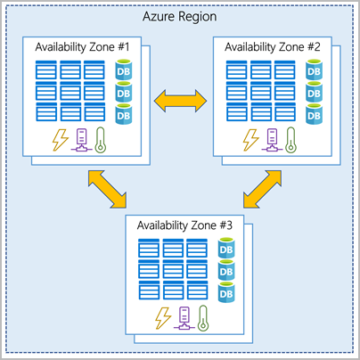

# Physical infrastructure

The physical infrastructure for Azure starts with datacenters. Conceptually, the datacenters are the same as large corporate datacenters. They’re facilities with resources arranged in racks, with dedicated power, cooling, and networking infrastructure.
As a global cloud provider, Azure has datacenters around the world. However, these individual datacenters aren’t directly accessible. Datacenters are grouped into Azure Regions or Azure Availability Zones that are designed to help you achieve resiliency and reliability for your business-critical workloads.

# Regions
A region is a geographical area on the planet that contains at least one, but potentially multiple datacenters that are nearby and networked together with a low-latency network. Azure intelligently assigns and controls the resources within each region to ensure workloads are appropriately balanced.

# Availability Zones
Availability zones are physically separate datacenters within an Azure region. Each availability zone is made up of one or more datacenters equipped with independent power, cooling, and networking. An availability zone is set up to be an isolation boundary. If one zone goes down, the other continues working. Availability zones are connected through high-speed, private fiber-optic networks.

Zonal services: You pin the resource to a specific zone (for example, VMs, managed disks, IP addresses).
Zone-redundant services: The platform replicates automatically across zones (for example, zone-redundant storage, SQL Database).
Non-regional services: Services are always available from Azure geographies and are resilient to zone-wide outages as well as region-wide outages.

### Additional advantages of region pairs:
- If an extensive Azure outage occurs, one region out of every pair is prioritized to make sure at least one is restored as quickly as possible for applications hosted in that region pair.
- Planned Azure updates are rolled out to paired regions one region at a time to minimize downtime and risk of application outage.
- Data continues to reside within the same geography as its pair (except for Brazil South) for tax- and law-enforcement jurisdiction purposes.

### Sovereign Regions
In addition to regular regions, Azure also has sovereign regions. Sovereign regions are instances of Azure that are isolated from the main instance of Azure. You may need to use a sovereign region for compliance or legal purposes.

