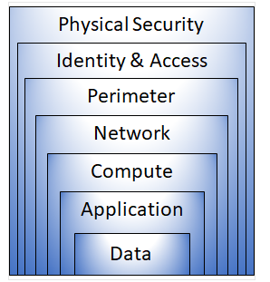

# Azure Directory Services Overview
 
### Microsoft Entra ID:
- A cloud-based directory service for managing identities and access to Microsoft cloud applications and custom-developed applications.
- Supports integration with on-premises Active Directory (AD), enhancing security and providing global availability.
- Familiar to users of traditional Active Directory with added cloud benefits.
 
### Key Users:
- IT Administrators: Manage access to applications and resources based on business needs.
- App Developers: Integrate identity services like Single Sign-On (SSO) into applications.
- End Users: Manage their identities with features like self-service password reset.
- Online Service Subscribers: Users of Microsoft 365, Azure, and Dynamics CRM Online use Microsoft Entra ID for authentication.
 
### Core Services:
- Authentication: Identity verification, self-service password reset, multifactor authentication, and smart lockout.
- Single Sign-On (SSO): One set of credentials for multiple applications, simplifying access management.
- Application Management: Manage cloud and on-premises apps with tools like Application Proxy and My Apps portal.
- Device Management: Supports device registration and management through Microsoft Intune and enforces Conditional Access policies.
 
### Integration with On-Premises AD:
- Microsoft Entra Connect: Syncs identities between on-premises AD and Microsoft Entra ID for a unified experience, enabling SSO, multifactor authentication, and self-service password reset.
 
### Microsoft Entra Domain Services:
- Provides managed domain services (e.g., domain join, group policy, LDAP, Kerberos/NTLM) without managing domain controllers (DCs).
- Supports legacy applications in the cloud without requiring on-premises AD DS.
- Integration with Microsoft Entra ID: Users can sign in using existing credentials, and existing groups and accounts secure access to resources.
 
### Functionality:
- A unique domain namespace is defined for the managed domain, with two Windows Server DCs deployed in Azure.
- Azure handles the DCs' management, configuration, updates, backups, and encryption.
- One-way synchronization from Microsoft Entra ID to the managed domain.
- Applications and services in Azure can use domain join, group policy, LDAP, and Kerberos/NTLM authentication.
 
### Conclusion:
Azure Directory Services, through Microsoft Entra ID and Microsoft Entra Domain Services, provides a comprehensive identity and access management solution that integrates cloud and on-premises environments, enhances security, and simplifies management.

# Azure Authentication Methods Overview
 
Authentication is the process of verifying the identity of a person, service, or device by requiring credentials. Azure supports several authentication methods, each balancing security and convenience.
 
### Authentication Methods in Azure:
 
1. Passwords:
   - Traditional method requiring users to provide a password.
   - Low security but high convenience.
 
2. Single Sign-On (SSO):
   - Allows users to sign in once and use the same credentials to access multiple resources and applications.
   - Simplifies identity management by reducing the number of passwords users need to remember.
   - Increases security by tying access to a single identity, making it easier to manage access changes as users change roles or leave an organization.
   - Only as secure as the initial authenticator.
 
3. Multifactor Authentication (MFA):
   - Requires two or more forms of identification during sign-in.
   - Increases security by adding additional verification steps beyond just a password.
   - Elements include something the user knows (e.g., password), something the user has (e.g., code sent to a phone), and something the user is (e.g., biometric).
   - Helps protect against password compromises.
 
4. Passwordless Authentication:
   - Eliminates the need for passwords, using other credentials like biometrics or security keys.
   - Provides both high security and high convenience.
   - Authentication is done using something the user has (e.g., registered device) and something the user knows or is (e.g., PIN or fingerprint).
 
### Passwordless Authentication Options in Azure:
 
1. Windows Hello for Business:
   - Ideal for users with their own designated Windows PC.
   - Uses biometric (fingerprint or facial recognition) or PIN credentials tied to the user's device.
   - Integrates with public key infrastructure (PKI) and supports SSO.
 
2. Microsoft Authenticator App:
   - Turns an iOS or Android phone into a passwordless authentication device.
   - Users receive a notification, match a number on their phone, and confirm with biometric or PIN.
 
3. FIDO2 Security Keys:
   - Unphishable, standards-based method.
   - Can be USB devices or use Bluetooth/NFC.
   - Users authenticate using an external security key, eliminating the need for passwords.
 
### Advantages of Azure Authentication Methods:
 
- Improved Security: Methods like MFA and passwordless authentication significantly reduce the risk of credential-related security incidents.
- Enhanced User Experience: SSO and passwordless authentication simplify the user experience by reducing the number of credentials users need to manage.
- Efficient Management: Simplifies identity management for IT administrators, making it easier to handle role changes and user departures.
 
Azure's diverse authentication methods provide flexible and secure options tailored to the needs of different organizations, ensuring both robust security and user convenience.
 
 
# Azure External Identities Overview
 
### What are External Identities?
- External identities refer to users, devices, or services outside your organization that interact with your resources.
- Microsoft Entra External ID allows secure interactions with these external users, enabling collaboration with partners, distributors, suppliers, vendors, and managing customer identities for consumer-facing apps.
 
### Key Features of External Identities:
 
1. Bring Your Own Identity:
   - External users can sign in using their existing credentials, whether from a corporate, government-issued, or social identity provider (e.g., Google, Facebook).
   - The external user’s identity provider manages their identity while access to your apps is controlled using Microsoft Entra ID or Azure AD B2C.
 
2. Capabilities:
   - Business to Business (B2B) Collaboration:
     - External users (e.g., partners, suppliers) can use their preferred identity to sign into Microsoft and other enterprise applications.
     - These users are typically represented as guest users in your directory.
   - B2B Direct Connect:
     - Establishes a mutual two-way trust with another Microsoft Entra organization.
     - Supports Teams shared channels, allowing external users to access resources within their home Teams instance.
     - These users are not represented in your directory but are visible in the Teams shared channel and can be monitored through Teams admin center reports.
   - Business to Customer (B2C):
     - Manages consumer and customer identities for modern SaaS or custom-developed apps using Azure AD B2C.
     - Publishes apps for consumers, managing their identity and access securely.
 
3. Collaboration and Access Management:
   - Administrators or users can invite guest users from other tenants for collaboration.
   - Social identities (e.g., Microsoft accounts) can also be used for inviting guest users.
   - Access reviews can be conducted to ensure guest users have appropriate access.
   - Decision-makers or the guests themselves can participate in access reviews to recertify access needs based on recommendations from Microsoft Entra ID.
   - After reviews, access can be adjusted or removed for users who no longer require it.
 
### Conclusion:
Microsoft Entra External ID offers a flexible and secure way to manage interactions with users outside your organization, providing capabilities for B2B collaboration, direct connect, and B2C scenarios. This system ensures that external users can use their existing identities, while you maintain control over access to your resources.

# Azure Conditional Access Overview
 
### What is Conditional Access?
Conditional Access is a security tool in Microsoft Entra ID that controls access to resources based on identity signals such as user identity, location, and device.
 
### Key Functions:
- Empower User Productivity: Allows users to work from anywhere at any time.
- Protect Organizational Assets: Ensures that access to resources is secure by evaluating various signals.
 
### How Conditional Access Works:
- Signal Collection: During sign-in, signals such as the user’s location, device, and the application being accessed are collected.
- Decision Making: Based on the collected signals, a decision is made whether to allow access, deny access, or require multifactor authentication (MFA).
Example decisions:
     - Full access if the user is signing in from a usual location.
     - Block access or require MFA if the user is signing in from an unusual or high-risk location.
- Enforcement: The decision is enforced by allowing access, denying access, or prompting for MFA.
 
### When to Use Conditional Access:
- Require MFA Based on Context: Implement MFA for certain roles, locations, or network conditions.
  - Example: Require MFA for administrators or users connecting from outside the corporate network.

- Restrict Access to Approved Applications: Limit access to services through specific client applications.
   - Example: Only allow certain email apps to connect to your email service.

- Mandate Managed Devices: Ensure users access applications only from devices that meet security and compliance standards.
   - Example: Require users to use managed devices for accessing sensitive applications.

- Block Access from Untrusted Sources: Prevent access from unknown or unexpected locations to enhance security.
   - Example: Block access attempts from high-risk geographical areas.
 
### Conclusion:
Azure Conditional Access is a powerful tool that helps IT administrators balance user productivity and security by controlling access to resources based on dynamic identity signals. It provides granular control over access conditions, ensuring that organizational assets are protected while allowing legitimate users to work seamlessly.

# Azure Role-Based Access Control (RBAC) Overview

### Purpose:
Azure Role-Based Access Control (RBAC) allows you to manage who has access to Azure resources, what they can do with those resources, and what areas they have access to. This is crucial for applying the principle of least privilege, ensuring users have only the necessary permissions to perform their tasks.
 
### Key Features:
 
1. Built-in and Custom Roles:
   - Built-in Roles: Azure provides predefined roles that cover common access needs, such as Reader, Contributor, and Owner.
   - Custom Roles: You can create custom roles tailored to specific needs, defining precise access permissions.
 
2. Role Assignments:
   - When you assign a role to a user or group, they inherit the permissions associated with that role.
   - This simplifies managing access, as adding a new user to an existing role automatically grants them the same permissions as other users in that role.
 
3. Hierarchical Scope:
   - Scope Levels: Permissions can be assigned at different scopes:
     - Management Group: Applies to all subscriptions within the group.
     - Subscription: Applies to all resource groups and resources within the subscription.
     - Resource Group: Applies to all resources within the group.
     - Individual Resource: Applies to a specific resource.
   - Inheritance: Permissions granted at a parent scope are inherited by all child scopes. For example, assigning a role at the subscription level applies those permissions to all resource groups and resources within that subscription.
 
4. Practical Application:
   - Engineering Teams: Adding a new engineer to the RBAC group for engineers grants them the same access as other engineers, streamlining the onboarding process.
   - Dynamic Resource Management: Adding new resources to a scope automatically extends the appropriate permissions to users in the relevant RBAC group.
 
### Enforcement Mechanism:
 
1. Resource Manager Integration:
   - Azure RBAC is enforced through Azure Resource Manager, which handles the organization and security of cloud resources.
   - Permissions are checked when actions are initiated against Azure resources via the Azure portal, Azure Cloud Shell, Azure PowerShell, or the Azure CLI.
 
2. Allow Model:
   - Azure RBAC operates on an allow model, meaning that users can perform actions if their assigned roles grant them the necessary permissions.
   - Combined Permissions: If multiple roles are assigned, the user’s effective permissions are the union of all assigned roles. For example, if one role grants read access and another grants write access to the same resource, the user will have both read and write access.
 
### Summary:
Azure RBAC provides a flexible and efficient way to manage access to Azure resources by assigning roles to users and groups at different scopes. It helps enforce the principle of least privilege and simplifies the management of permissions across large and dynamic cloud environments.

# Zero Trust Model Overview
 
### Definition:
The Zero Trust security model operates under the principle that no entity, whether inside or outside the organization, should be trusted by default. Every request is verified as if it originates from an uncontrolled network, assuming a breach has already occurred.
 
### Key Principles:
 
1. Verify Explicitly:
   - Always authenticate and authorize based on all available data points, such as user identity, location, device health, service or workload, data classification, and anomalies.
   
2. Use Least Privilege Access:
   - Limit user and device access to only what is necessary. Implement Just-In-Time (JIT) and Just-Enough-Access (JEA) policies, enforce risk-based adaptive controls, and prioritize data protection.
 
3. Assume Breach:
   - Operate as though a breach is inevitable or has already occurred. Minimize damage potential by segmenting access, implementing end-to-end encryption, and using analytics for threat detection and defensive improvements.
 
### Modern Security Requirements:
- Adapting to Complexity: Modern environments are more complex, requiring a security model that can adapt effectively.
- Mobile Workforce: Supports and protects a workforce that is increasingly mobile and remote.
- Universal Protection: Ensures protection of people, devices, applications, and data regardless of location.
 
### Implementation Shifts:
- Traditional Model: Previously, corporate networks were considered safe, with controlled VPN access and restricted personal devices.
- Zero Trust Approach: Under Zero Trust, the safety of a device is not assumed based on network location. Authentication is required for every access attempt, and access is granted based on the outcome of the authentication process rather than the device's location.
 
### Summary:
The Zero Trust model is a proactive security framework that verifies every access request, enforces strict access controls, and continuously monitors for threats. This model is essential for adapting to modern security challenges, ensuring comprehensive protection across diverse environments and endpoints.
 

# Defense-in-Depth Overview
 
### Objective
The objective of defense-in-depth is to protect information and prevent unauthorized access. It employs multiple layers of security mechanisms to slow down and mitigate the impact of an attack.
 
### Concept
Defense-in-depth can be visualized as a series of concentric layers surrounding the data to be protected. Each layer provides a distinct form of security, ensuring that if one layer is breached, the next layer continues to offer protection. This multi-layered approach reduces reliance on any single security measure, helping to slow down attacks and provide alert information for security teams to act upon.
 
 

## Layers of Defense-in-Depth
 
1. Physical Security:
   - Role: First line of defense; protects the physical computing hardware in data centers.
   - Key Measures: Access control to buildings, secure handling of hardware.
 
2. Identity and Access:
   - Role: Manages who has access to resources and infrastructure.
   - Key Measures: Single sign-on (SSO), multifactor authentication (MFA), access control, event logging.
 
3. Perimeter:
   - Role: Protects against network-based attacks.
   - Key Measures: Distributed denial of service (DDoS) protection, perimeter firewalls.
 
4. Network:
   - Role: Controls internal communication and network connectivity.
   - Key Measures: Network segmentation, access control, secure connectivity, default deny policies.
 
5. Compute:
   - Role: Ensures the security of virtual machines and other compute resources.
   - Key Measures: Securing VM access, endpoint protection, patch management.
 
6. Application:
   - Role: Ensures applications are developed and maintained with security in mind.
   - Key Measures: Secure development practices, vulnerability management, secure storage of application secrets.
 
7. Data:
   - Role: Protects the actual data, ensuring its confidentiality, integrity, and availability.
   - Key Measures: Data encryption, access control, compliance with regulatory requirements.
 
### Azure's Role:
Azure provides a variety of tools and features to implement security at each layer of the defense-in-depth strategy. These tools help ensure comprehensive protection of resources in the cloud.
 
## Key Considerations for Each Layer:
 
- Physical Security: Ensure physical access controls to prevent unauthorized physical access.
- Identity and Access: Implement SSO, MFA, and regular auditing of access changes.
- Perimeter: Use DDoS protection and firewalls to defend against large-scale network attacks.
- Network: Limit communication to only what's necessary, enforce strict access controls.
- Compute: Keep systems patched, secure VM access, and use endpoint protection.
- Application: Develop applications with security best practices, manage vulnerabilities, and secure sensitive information.
- Data: Encrypt data, enforce access controls, and comply with relevant regulations.
 
By implementing these layers, organizations can create a robust security posture that significantly reduces the risk of successful attacks and helps protect their most valuable assets—data.

# Microsoft Defender for Cloud Summary
 
### Overview:
Microsoft Defender for Cloud is a security monitoring tool designed to manage security posture and protect against threats across cloud, on-premises, hybrid, and multi-cloud environments. It offers tools to enhance resource security, monitor security posture, defend against cyber-attacks, and streamline security management.
 
### Key Features:
 
1. Protection Across Deployments:
   - Azure-Native Integration: Many Azure services are automatically protected.
   - On-Premises and Multi-Cloud Support: Defender for Cloud extends protection to non-Azure environments using Azure Arc. It can automatically deploy a Log Analytics agent for security data collection.
   
2. Azure-Native Protections:
   - Threat Detection: Monitors Azure PaaS services (e.g., Azure App Service, SQL, Storage Account) and data services, detecting anomalies and potential vulnerabilities.
   - Network Protection: Limits exposure to brute-force attacks by managing virtual machine port access and applying just-in-time VM access.
 
3. Hybrid and Multi-Cloud Defense:
   - Hybrid Cloud: Defender for Cloud can protect on-premises servers by deploying Azure Arc and enabling enhanced security features.
   - Multi-Cloud: Provides protection for resources on other clouds like AWS and GCP. Features include CSPM, container threat detection, and server protection.
 
### Core Functions:
 
1. Assess:
   - Continuous Assessment: Regular vulnerability scans for VMs, container registries, and SQL servers. Native integration with Microsoft Defender for Endpoint provides detailed vulnerability findings.
   
2. Secure:
   - Security Policies: Uses Azure Policy to set tailored security policies, ensuring workloads are secure. Constantly monitors new resources and flags configurations that deviate from security best practices.
   - Recommendations: Provides prioritized security recommendations based on the Azure Security Benchmark, grouping them into security controls and assigning a secure score to indicate overall security posture.
 
3. Defend:
   - Security Alerts: Generates alerts for detected threats, providing remediation steps and automated responses. Utilizes fusion kill-chain analysis for correlating alerts and understanding attack campaigns.
   - Advanced Threat Protection: Offers protections like just-in-time access for VM management ports and adaptive application controls to whitelist approved applications.
 
### Benefits:
Defender for Cloud helps organizations:
   - Continuously assess and improve their security posture.
   - Securely manage cloud resources with policies and benchmarks.
   - Detect and respond to threats efficiently, ensuring a robust defense against cyber attacks.
 
By integrating these features, Microsoft Defender for Cloud provides comprehensive security management, ensuring robust protection across various environments and enhancing overall cybersecurity resilience.

