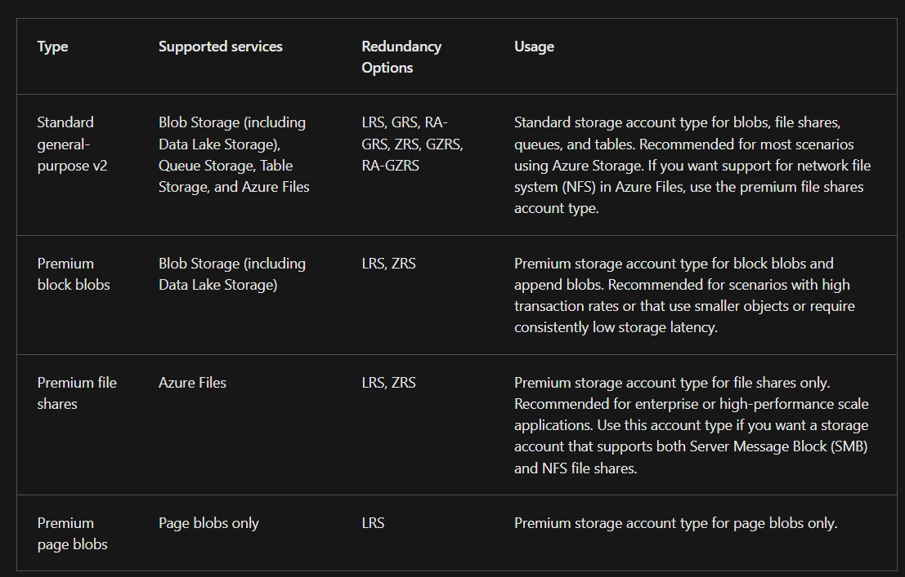
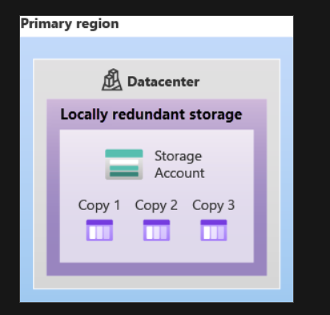
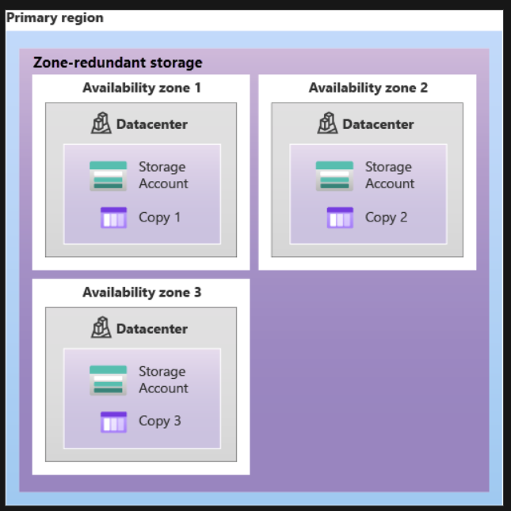
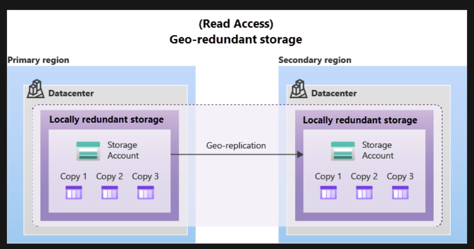
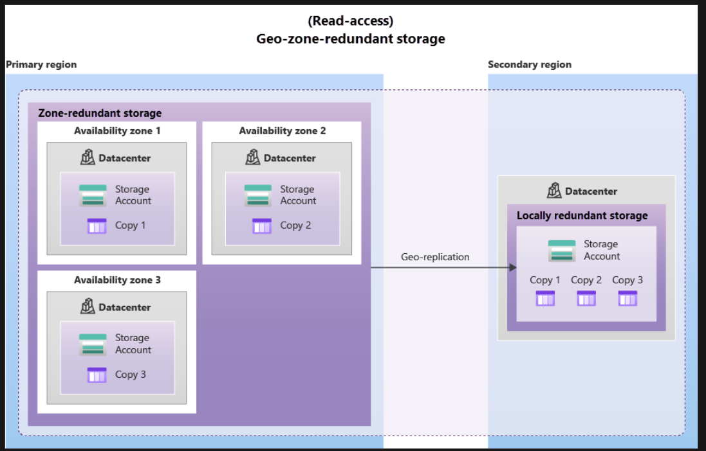

# Describe Azure storage accounts

A storage account in Azure provides a unique namespace for your data, accessible globally via HTTP or HTTPS. This data is secure, highly available, durable, and massively scalable. When creating a storage account, you choose the type, which influences available services and redundancy options. The redundancy options are

- Locally redundant storage (LRS)
- Geo-redundant storage (GRS)
- Read-access geo-redundant storage (RA-GRS)
- Zone-redundant storage (ZRS)
- Geo-zone-redundant storage (GZRS)
- Read-access geo-zone-redundant storage (RA-GZRS)

An Azure Storage Account provides a unique namespace for your data by requiring a unique account name within Azure. The combination of this account name and the Azure Storage service endpoint forms your storage account's endpoints. When naming your storage account:

- Names must be 3 to 24 characters long.
- Names can include numbers and lowercase letters only.
- Each name must be unique across Azure to ensure a unique namespace.

The endpoint format for Azure Storage services varies and is typically shown in a specific table format.

# Describe Azure storage redundancy

## Azure Storage Redundancy Overview

Azure Storage ensures data protection and availability by storing multiple copies of your data. This redundancy safeguards against hardware failures, network or power outages, and natural disasters, allowing Azure Storage to meet its availability and durability targets even during failures.

## Redundancy Options

### Primary Region Redundancy
Data in Azure Storage accounts is replicated three times in the primary region. There are two primary redundancy options:

1. Locally Redundant Storage (LRS)
   - Replicates data three times within a single data center.
   - Offers 99.999999999% (11 nines) durability.
   - Lowest cost but vulnerable to data center-wide failures.

2. Zone-Redundant Storage (ZRS)
   - Replicates data across three availability zones in the primary region.
   - Provides 99.9999999999% (12 nines) durability.
   - Ensures data availability even if one zone fails, suitable for high availability needs.

### Secondary Region Redundancy
For enhanced durability, data can be replicated to a secondary region hundreds of miles away, ensuring durability even in regional disasters.

1. Geo-Redundant Storage (GRS)
   - Replicates data within a single location in the primary region using LRS.
   - Asynchronously copies data to a single location in the secondary region (LRS).
   - Provides 99.99999999999999% (16 nines) durability.

2. Geo-Zone-Redundant Storage (GZRS)
   - Combines ZRS in the primary region with LRS in the secondary region.
   - Ensures 99.99999999999999% (16 nines) durability, offering high availability and regional disaster protection.

### Read Access to Secondary Region

For read access to data in the secondary region, Azure provides:

- Read-Access Geo-Redundant Storage (RA-GRS)
- Read-Access Geo-Zone-Redundant Storage (RA-GZRS)

These options allow data to be read from the secondary region even when the primary region is operational, enhancing accessibility and availability.

## Considerations

- Replication Tradeoffs: Weigh cost against availability needs.
- RPO (Recovery Point Objective): Data replication is asynchronous, with an RPO typically under 15 minutes, indicating potential data loss during primary region failures.

Azure Storage redundancy options ensure data durability and availability by replicating data within and across regions, meeting diverse requirements from cost-effectiveness to high availability and disaster recovery.

# Describe Azure Storage Services

## Azure Storage Platform

Azure Storage provides various data services to cater to different storage needs:

1. Azure Blobs: Scalable object storage for text and binary data, supporting big data analytics via Data Lake Storage Gen2.
2. Azure Files: Managed file shares accessible by cloud or on-premises deployments.
3. Azure Queues: Reliable messaging store for communication between application components.
4. Azure Disks: Block-level storage volumes for Azure VMs.
5. Azure Tables: NoSQL storage for structured, non-relational data.

## Benefits of Azure Storage

- Durable and Highly Available: Redundant storage protects against hardware failures and outages, with options for cross-region replication.
- Secure: All data is encrypted, with fine-grained access control.
- Scalable: Massively scalable to meet modern application demands.
- Managed: Azure handles hardware maintenance and critical updates.
- Accessible: Accessible globally via HTTP/HTTPS, with support for various programming languages and tools.

## Azure Blob Storage

- Overview: Object storage for unstructured data like text, binary data, videos, and logs.
- Access: Data is accessible worldwide via URLs, REST API, PowerShell, CLI, or client libraries.
- Storage Tiers: 
  - Hot: Frequent access.
  - Cool: Infrequent access (stored for at least 30 days).
  - Cold: Rarely accessed (stored for at least 90 days).
  - Archive: Long-term storage with flexible latency (stored for at least 180 days).

## Azure Files

- Overview: Fully managed file shares using SMB or NFS protocols.
- Key Benefits:
  - Shared access compatible with various operating systems.
  - Fully managed, eliminating the need for hardware or OS maintenance.
  - Integration with PowerShell, CLI, and Azure portal for management.
  - Resilient and always available, ideal for replacing on-premises shares.
  - Familiar programmability for seamless application migration.

## Azure Queues

- Overview: Service for storing and accessing large numbers of messages for asynchronous processing.
- Use Case: Integrates with Azure Functions to trigger actions upon message receipt.

## Azure Disks

- Overview: Block-level storage volumes managed by Azure for VMs, offering enhanced resiliency and availability.

## Azure Tables

- Overview: NoSQL storage for large amounts of structured, non-relational data.
- Use Case: Ideal for building hybrid or multi-cloud solutions with always-available data.

Azure Storage provides a comprehensive suite of services designed to meet diverse storage requirements, ensuring data durability, security, scalability, and accessibility.

Identify Azure data migration options

## Migrating Data to Azure

Azure offers robust solutions for migrating your data, infrastructure, and applications to the cloud. These solutions include real-time migration with Azure Migrate and asynchronous migration using Azure Data Box.

### Azure Migrate

Azure Migrate is a service designed to assist with the migration from on-premises environments to Azure. It provides:

- Unified Migration Platform: A single portal for starting, running, and tracking your migration.
- Range of Tools: Tools for assessment and migration, including:
  - Discovery and Assessment: Discovers and assesses on-premises servers (VMware, Hyper-V, physical servers).
  - Server Migration: Migrates VMware VMs, Hyper-V VMs, physical servers, other virtualized servers, and public cloud VMs to Azure.
  - Data Migration Assistant: Assesses SQL Servers for potential migration issues and benefits.
  - Azure Database Migration Service: Migrates on-premises databases to Azure SQL environments.
  - Azure App Service Migration Assistant: Assesses and migrates .NET and PHP web apps to Azure App Service.

### Azure Data Box

Azure Data Box is a physical device for transferring large amounts of data to and from Azure. Key features include:

- Capacity: Up to 80 terabytes of data.
- Security: Data is encrypted and protected in a rugged case during transit.
- Order and Setup: Ordered via the Azure portal, easily set up using a local web UI.
- Use Cases: Ideal for large data transfers, especially when network connectivity is limited. Suitable for one-time migrations, periodic uploads, or initial bulk transfers followed by incremental network transfers.

#### Importing Data to Azure with Data Box
- Scenarios:
  - One-time migrations of large data volumes.
  - Transferring media libraries from offline tapes.
  - Migrating VM farms, SQL servers, and applications.
  - Moving historical data for analysis and reporting.

#### Exporting Data from Azure with Data Box
- Scenarios:
  - Disaster recovery: Restoring a large amount of Azure data to on-premises.
  - Security requirements: Exporting data due to government or security needs.
  - Migrating back to on-premises or to another cloud provider.

Data Box ensures the secure and efficient transfer of large data volumes, with disks wiped clean according to NIST 800-88r1 standards after transfer.

### Summary

Azure Migrate and Azure Data Box provide comprehensive tools for migrating data, infrastructure, and applications to Azure. Azure Migrate offers a unified platform for real-time migrations, while Azure Data Box facilitates secure, large-scale data transfers, ensuring flexibility and efficiency for various migration scenarios.

Identify Azure file movement options

# Azure Tools for Managing Individual Files or Small File Groups

In addition to large-scale migration services like Azure Migrate and Azure Data Box, Azure provides several tools for managing individual files or small groups of files. These tools include AzCopy, Azure Storage Explorer, and Azure File Sync.

## AzCopy

AzCopy is a command-line utility for transferring files and blobs to and from Azure Storage accounts. Key features include:

- Capabilities: Upload, download, copy between storage accounts, and synchronize files.
- Cross-Cloud Support: Configurable to work with other cloud providers for file transfers between clouds.
- One-Directional Synchronization: Synchronizes files or blobs in one direction only (from source to destination).

## Azure Storage Explorer

Azure Storage Explorer is a graphical interface application for managing files and blobs in Azure Storage accounts. Key features include:

- Cross-Platform: Available on Windows, macOS, and Linux.
- File Management: Upload, download, and move files between storage accounts.
- Backend: Utilizes AzCopy for performing file and blob management tasks.

## Azure File Sync

Azure File Sync centralizes file shares in Azure Files while maintaining the performance and compatibility of a Windows file server. Key features include:

- Bi-Directional Sync: Automatically syncs files between local Windows servers and Azure.
- Protocol Support: Supports SMB, NFS, and FTPS protocols for local data access.
- Global Caching: Allows multiple caches across different locations.
- Disaster Recovery: Enables quick replacement of failed local servers by installing Azure File Sync on new servers.
- Cloud Tiering: Keeps frequently accessed files locally and stores infrequently accessed files in the cloud until needed.

These tools provide flexible and efficient ways to manage individual files or small groups of files within Azure, complementing the larger-scale migration options.

