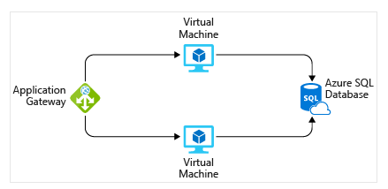

# Azure Cost Management Summary
 
## Transition from CapEx to OpEx:
Azure shifts costs from capital expense (CapEx) of building and maintaining infrastructure to operational expense (OpEx) of renting infrastructure. This OpEx model is influenced by several factors:
 
1. Resource Type:
   - Costs vary based on resource type, settings, and region.
   - Example: Storage accounts vary in cost based on type (e.g., blob), performance tier, access tier, redundancy settings, and region. Virtual machines (VMs) vary based on licensing, processor type, number of cores, attached storage, and network interface.
 
2. Consumption:
   - Azure uses a pay-as-you-go model, where costs are based on actual resource usage during a billing cycle.
   - Reserved Resources: Azure offers discounts for committing to a certain amount of resource usage in advance (e.g., one or three years), providing significant savings for consistent workloads.
 
3. Maintenance:
   - Regularly maintaining and organizing resources can help control costs. For example, ensuring that additional resources provisioned with VMs are deprovisioned when no longer needed.
 
4. Geography:
   - Costs vary by region due to differences in power, labor, taxes, and fees.
   - Network traffic costs also vary based on geography, with lower costs for data movement within regions.
 
5. Network Traffic:
   - Costs are influenced by data movement, with inbound data transfers typically free and outbound transfers priced based on geographical zones.
 
6. Subscription Type:
   - Different subscription types offer various allowances and benefits.
   - Example: An Azure free trial includes access to products free for 12 months and credit for the first 30 days, with additional always-free products based on resource and region availability.
 
7. Azure Marketplace:
   - Allows purchase of Azure-based solutions and services from third-party vendors, which may involve additional costs for vendor services or expertise.
   - All solutions in Azure Marketplace are certified and compliant with Azure policies and standards.
 
By understanding and managing these factors, users can optimize their Azure costs and take advantage of savings opportunities.
 
## Comparison of Azure Pricing and Total Cost of Ownership (TCO) Calculators
 
Azure provides two distinct calculators to help understand potential expenses: the Pricing Calculator and the Total Cost of Ownership (TCO) Calculator. Both tools are accessible online and allow you to build out configurations, but they serve different purposes.
 
Pricing Calculator:
- Purpose: To estimate costs for provisioning resources in Azure.
- Functionality: 
  - Allows estimation for individual resources or entire solutions.
  - Can be used to see costs based on example scenarios.
  - Focuses on the cost of resources like compute, storage, and network.
  - Factors in different options like storage type, access tier, and redundancy.
- Usage: For information purposes only; no actual provisioning or charges occur from its use.
- Output: Provides an estimated cost for the resources added to the calculator.
 
TCO Calculator:
- Purpose: To compare costs of running on-premises infrastructure versus Azure Cloud infrastructure.
- Functionality:
  - Users input their current infrastructure details, including servers, databases, storage, and network traffic.
  - Includes assumptions for additional costs like power and IT labor.
  - Compares current on-premises costs with the anticipated costs of running the same infrastructure in Azure.
- Usage: Helps in financial planning and decision-making by showing potential savings and cost differences.
- Output: Provides an estimation of cost differences between on-premises and Azure environments.
 
In summary, the Pricing Calculator is best for estimating the costs of specific Azure resources and building configurations within Azure. In contrast, the TCO Calculator is ideal for comparing the total costs of maintaining existing on-premises infrastructure versus migrating to Azure, taking into account broader operational expenses.

## Microsoft Cost Management Tool Overview
 
Microsoft Cost Management is a service designed to help Azure users effectively monitor and manage their cloud spending. It offers several key features to help users understand and control their costs.
 
Cost Analysis:
- Allows users to visualize their Azure costs quickly and easily.
- Provides insights into total costs by billing cycle, region, resource, etc.
- Helps identify spending trends and track costs over time against budgets.
 
Cost Alerts:
- Offers three types of alerts: Budget alerts, Credit alerts, and Department spending quota alerts.
- Budget alerts notify users when spending reaches or exceeds defined budget thresholds.
- Credit alerts notify users when Azure credit commitments are consumed, particularly relevant for organizations with Enterprise Agreements (EAs).
- Department spending quota alerts notify users when departmental spending reaches set thresholds.
 
Budgets:
- Enable users to set spending limits for Azure resources based on various criteria such as subscription, resource group, or service type.
- Allow users to configure budget alerts to trigger notifications when spending approaches or exceeds defined thresholds.
- Advanced use of budgets enables automation triggers to suspend or modify resources once specified conditions are met.
 
In summary, Microsoft Cost Management provides users with tools to monitor, analyze, and control their Azure spending effectively, helping them avoid unexpected costs and stay within budget.
 
## Purpose of Tags Overview
 
Tags are metadata labels that provide additional information about resources in Azure. They serve various purposes aimed at organization, cost management, operations management, security, governance, workload optimization, and automation.
 
Resource Management:
- Tags help organize resources based on workloads, environments, business units, and owners.
- Facilitate locating and managing resources associated with specific purposes or stakeholders.
 
Cost Management and Optimization:
- Enable grouping resources for cost reporting, internal cost allocation, budget tracking, and cost forecasting.
- Aid in optimizing spending by visualizing resource usage patterns and identifying cost-saving opportunities.
 
Operations Management:
- Support grouping resources based on criticality for formulating service-level agreements (SLAs) and ensuring uptime or performance guarantees.
 
Security:
- Classify data by security level (e.g., public or confidential) to enforce security policies and access controls.
 
Governance and Regulatory Compliance:
- Identify resources that align with governance or regulatory requirements (e.g., ISO 27001).
- Enforce tagging rules and conventions through Azure Policy to ensure compliance and standards enforcement.
 
Workload Optimization and Automation:
- Visualize resources participating in complex deployments by tagging them with associated workload or application names.
- Enable automation tasks using software like Azure DevOps based on resource tags.
 
Managing Resource Tags:
- Tags can be added, modified, or deleted using various Azure management tools such as PowerShell, Azure CLI, Azure Resource Manager templates, REST API, or Azure portal.
- Azure Policy can enforce tagging rules, requiring specific tags on resources, and reapplying removed tags.
- Tags can be applied at different levels (e.g., resource, resource group, subscription) with custom tagging schemas to meet organizational needs.
 
In summary, resource tags in Azure play a crucial role in organizing, managing, optimizing, and securing cloud resources, providing users with enhanced visibility and control over their Azure environment.
 
