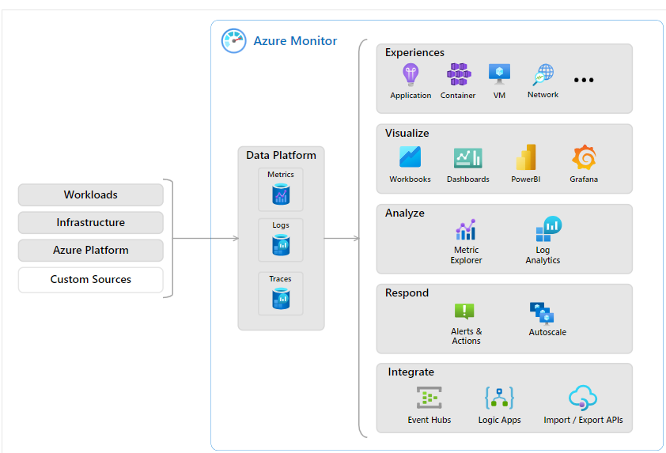

#Azure Advisor:
 
Azure Advisor is a service that evaluates Azure resources to provide recommendations for enhancing reliability, security, performance, operational excellence, and cost optimization. It aims to streamline cloud optimization efforts and offers actionable suggestions that users can implement immediately, postpone, or dismiss.
 
Key Features:
- Recommendations: Azure Advisor offers personalized recommendations through the Azure portal and API, covering various aspects like reliability, security, performance, operational excellence, and cost optimization.
- Dashboard: Users can access recommendations via the Azure portal's Advisor dashboard, where suggestions are categorized based on their relevance to specific subscriptions, resource groups, or services.
- Categories: Recommendations are divided into five categories:
  - Reliability: Enhancing continuity for critical applications.
  - Security: Identifying and addressing potential threats and vulnerabilities.
  - Performance: Improving application speed.
  - Operational Excellence: Enhancing process efficiency and deployment best practices.
  - Cost: Optimizing and reducing Azure spending.
- Notifications: Users can set up notifications to receive alerts about new recommendations, ensuring timely action on optimization opportunities.
 
# Azure Service Health:
 
Azure Service Health is a comprehensive solution within Microsoft Azure that enables users to monitor the status of Azure resources, both at a global level and for individually deployed resources. It integrates three main Azure services:
 
1. Azure Status: Offers a broad overview of the global Azure infrastructure's status, providing information on service outages across all Azure regions. Users can access the Azure Status page for a global view of the health of Azure services.
  
2. Service Health: Provides a more focused view by offering insights into Azure services and regions specifically used by the user. It is the go-to place for service-related communications about outages, planned maintenance, and other health advisories. Users can set up alerts to receive notifications about service issues impacting their Azure services and regions.
  
3. Resource Health: Offers a tailored view of individual Azure resources, such as specific virtual machine instances. Through Azure Monitor, users can configure alerts to notify them of any availability changes to their cloud resources.
  
Azure Service Health combines these three components to provide users with a holistic view of their Azure environment, from the global status of Azure services down to specific resources. It also stores historical alerts, allowing users to review and investigate past incidents. Additionally, in the event of workload impacts, Azure Service Health provides links to support for further assistance.
 
 
 
# Azure Monitor:
 
Azure Monitor is a comprehensive platform designed for collecting, analyzing, visualizing, and acting upon data related to various resources. It can monitor Azure resources, on-premises resources, and even multi-cloud resources hosted with different providers.
 
Key components and features of Azure Monitor include:
 
1. Data Collection: Azure Monitor collects logging and metric data from every layer of your application architecture, including applications, operating systems, and networks.
 
2. Central Repositories: The collected data is stored in central repositories for further analysis and visualization.
 
3. Data Analysis: Users can view real-time and historical performance data across different layers of their architecture. Azure Monitor provides aggregated and detailed information tailored to different audiences.
 
4. Visualization: Users can create custom views using tools like Power BI and Kusto queries to visualize the collected data.
 
5. Alerting: Azure Monitor Alerts enable users to set up automated alerts based on specified thresholds. These alerts can be configured to notify teams via various channels and can also trigger corrective actions.
 
6. Azure Log Analytics: This tool allows users to write and run log queries on the data collected by Azure Monitor. Log Analytics supports both simple and complex queries for data analysis.
 
7. Application Insights: A feature of Azure Monitor, Application Insights monitors web applications running in Azure, on-premises, or in other cloud environments. It tracks various metrics related to application performance, user interactions, and system health.
 
Overall, Azure Monitor provides a comprehensive solution for monitoring, analyzing, and managing resources across different environments, helping users optimize performance, enhance reliability, and streamline operations.
 
