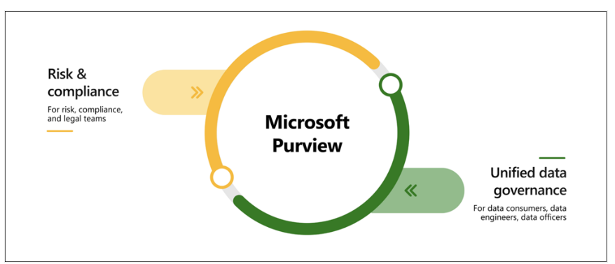

# Purpose of Microsoft Purview Overview
 
Microsoft Purview is a suite of data governance, risk, and compliance solutions designed to provide organizations with a unified view of their data across on-premises, multicloud, and software-as-a-service environments. It offers insights into data landscape through automated discovery, sensitive data classification, and end-to-end data lineage.
 
Automated Data Discovery:
- Microsoft Purview enables automated discovery of data across various sources, including on-premises, multicloud, and software-as-a-service platforms.
- It helps organizations gain visibility into their entire data estate, facilitating better management and governance.
 
Sensitive Data Classification:
- Purview offers capabilities for classifying sensitive data, allowing organizations to identify and protect critical information.
- It assists in compliance with regulatory requirements and mitigating data-related risks.
 
End-to-End Data Lineage:
- With Purview, organizations can trace the lineage of their data from its source to its destination, ensuring data integrity and reliability.
- It provides insights into how data is created, processed, and utilized within the organization.
 
Microsoft Purview Risk and Compliance Solutions:
- Leveraging Microsoft 365 services, Purview assists in managing and monitoring data across various platforms like Teams, OneDrive, and Exchange.
- It helps in protecting sensitive data, identifying data risks, managing regulatory compliance, and initiating regulatory compliance efforts.
 
Unified Data Governance:
- Purview offers robust data governance solutions for managing data across different environments, including Azure, SQL, Hive databases, and other clouds like Amazon S3.
- It facilitates the creation of a comprehensive map of the data estate, identification of sensitive data, establishment of secure data environments, generation of insights, and scalable management of data access.
 
In summary, Microsoft Purview serves as a comprehensive platform for organizations to manage, govern, and secure their data assets effectively across diverse environments, ensuring compliance, risk mitigation, and operational efficiency.

# Purpose of Azure Policy Overview
 
Azure Policy is a service in Azure designed to create, assign, and manage policies for controlling or auditing resources. It ensures resource configurations remain compliant with corporate standards by enforcing various rules across configurations.
 
Defining Policies:
- Azure Policy allows the creation of individual policies or groups of related policies called initiatives.
- These policies are evaluated against resources, highlighting non-compliant ones, and can prevent the creation of non-compliant resources.
 
Policy Scope and Inheritance:
- Policies can be set at different levels such as resource, resource group, or subscription, with inheritance ensuring policies set at higher levels apply to lower levels.
- For instance, setting a policy on a resource group automatically applies to all resources within it.
 
Built-in Policy Definitions:
- Azure Policy includes pre-defined policies and initiatives for Storage, Networking, Compute, Security Center, and Monitoring.
- It evaluates and monitors existing resources, ensuring compliance even for resources created before policy implementation.
 
Automated Remediation:
- In some cases, Azure Policy can automatically remediate noncompliant resources or configurations to maintain resource integrity.
- Exceptions can be flagged for specific resources that should not be automatically fixed by Azure Policy.
 
Integration with Azure DevOps:
- Azure Policy integrates with Azure DevOps, applying continuous integration and delivery pipeline policies for pre-deployment and post-deployment phases.
 
Azure Policy Initiatives:
- Initiatives group related policies together to track compliance for larger goals.
- They contain multiple policy definitions working towards a specific objective, facilitating compliance management for complex requirements.
 
# Purpose of Resource Locks Overview
 
Resource locks in Azure serve to prevent accidental deletion or modification of resources, providing an additional layer of protection alongside Azure role-based access control (Azure RBAC) policies.
 
Preventing Accidental Deletion or Modification:
- Even with Azure RBAC in place, there's a risk of critical resources being deleted by users with appropriate access levels.
- Resource locks mitigate this risk by preventing resources from being deleted or updated, depending on the lock type.
 
Scope and Inheritance:
- Resource locks can be applied at the level of individual resources, resource groups, or entire subscriptions.
- They are inherited, meaning a lock applied at a higher level, such as a resource group, is also enforced on all resources within that group.
 
Types of Resource Locks:
- Two types of resource locks exist: Delete and ReadOnly.
- Delete lock prevents deletion of a resource while allowing modifications, while ReadOnly lock restricts both deletion and updates, similar to the Reader role.
 
Managing Resource Locks:
- Resource locks can be managed through the Azure portal, PowerShell, Azure CLI, or Azure Resource Manager template.
- In the Azure portal, locks can be viewed, added, or deleted from the Settings section of a resource's Settings pane.
 
Handling Locked Resources:
- While resource locks prevent changes, they can be temporarily removed to allow modifications.
- Users must first remove the lock before making changes, regardless of their RBAC permissions, ensuring the integrity of critical resources.
 
 # Purpose of the Service Trust Portal
 
The Microsoft Service Trust Portal serves as a central platform offering access to diverse content, tools, and resources regarding Microsoft's security, privacy, and compliance practices.
 
Key Features and Content:
- It contains comprehensive information about Microsoft's implementation of controls and processes safeguarding their cloud services and customer data.
- Access to certain resources requires authentication with a Microsoft cloud services account (Microsoft Entra organization account), and acceptance of the Microsoft non-disclosure agreement for compliance materials.
 
Accessing the Portal:
- The portal can be accessed at https://servicetrust.microsoft.com/.
- Upon login, users can navigate through various menu categories for accessing different features and content.
 
Main Menu Categories:
1. Service Trust Portal: Provides a direct link back to the portal's home page.
2. My Library: Allows users to save documents for quick access on their personal My Library page, along with options to set up notifications for document updates.
3. All Documents: Offers a comprehensive repository of documents available on the portal, enabling users to pin relevant documents to their My Library.
 
Availability of Reports and Documents:
- Documents and reports on the Service Trust Portal remain downloadable for at least 12 months after publication or until newer versions are released, ensuring ongoing access to critical information.
 
 
 
